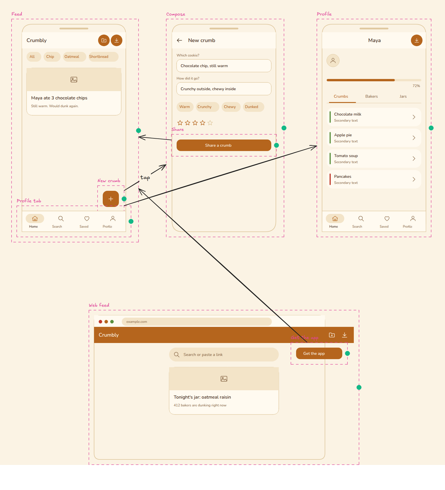
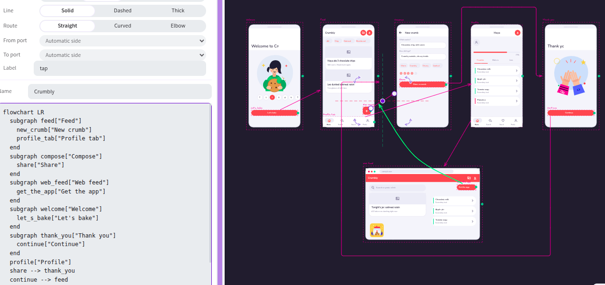

<h1 align="center">Alidraw</h1>

  Precise vector design of complete UI components. 
  Mermaid flowcharts drawn, restyled and re-laid out on the canvas, round trip by default.

## Mermaid flowcharts, with any element as a node

- A flow element is a decorator around any object or group: a label, a handle, ports. The Mermaid layer sits over the drawn elements, not in place of them.
- Replace a node's design without breaking the round trip:
  - swap it with a library item;
  - draw inside it;
  - nest steps inside a screen (a Mermaid `subgraph`).
- Text → canvas: paste or edit Mermaid in the Flow panel; existing drawings keep their design, only the changed nodes and links move.
- Canvas → text: drag a handle to link, add, rename or delete steps; the Mermaid source follows.
- Lossless round trip:
  - every node shape, link end and link length;
  - classes, directives, subgraph direction.
- Layout stored in the Mermaid file as comments, so the file stays valid Mermaid:
  - `%% @layout` for position and size;
  - `%% @ports` for ports;
  - `%% @link` for the port each link starts and ends on.
- Links are persistent decorators: an arrow keeps its route, colour and bindings when the flow is redrawn.
- Ports on steps (decision outcomes, loop body/exit/back), with a port editor and a link editor.
- Flow, state, architecture and programming symbols insert as flow elements.
- Import and export: Mermaid and Markdown.
- Example: [`docs/fixtures/crumbly/crumbly.mmd`](docs/fixtures/crumbly/crumbly.mmd).

## Vector drawing

- Bezier path element with tangent handles: open/close, split/join, holes, curve-preserving delete.
- Compound shapes (several outlines, holes work).
- Pathfinder: boolean operations on closed shapes and paths.
- Knife: cut shapes along a dragged line.
- Corners: round each corner on its own, with a live gizmo and a radius slider.
- Rotate and skew gizmo on shapes and groups; rotation locks onto other elements' axes.
- Rulers, draggable guides with an opt-out magnet, guide lock.
- Grid spacing, fit to grid, movable grid origin, anchors to elements and guides, Align panel.
- Named layers that own objects; groups shown as nested nodes.
- Typography:
  - installed fonts, typed font size, px/dp unit;
  - bold and italic;
  - font library of 85 open-licence families;
  - text to outlines.
- Default roughness 0; open paths whose ends meet are merged.

## UI components

- Themable icon and UI component library with parametric components (Symbols tab).
- Screen templates, pickers, carousel, grids.
- Ctrl+drag stretches a component with pinned layout.
- Convert any drawing to a symbol, with parameters: background, outline, texts.
- Flat vector illustrations (Symbols → Art), inserted as editable paths.
- Default theme Pop: white sheets, coral accent.

## Colour

- Colour picker: saturation square, hue bar, `#rrggbbaa`; a drag is one undo step.
- Harmonies:
  - wheel and eight rules;
  - palettes and colours taken from a picture;
  - a whole theme from a harmony.
- Palette panel: draggable, persistent, named swatches in a grid, swatch export.
- Vectorize images: palette from the picture, smooth outlines, holes kept.

## Inspector and panels

- Right-docked inspector; panels float, snap to screen edges and to each other.
- Layers panel can be popped out.
- Configurable Tools section with every overflow tool.

## Import and export

- PDF (vector) with page options.
- HTML and Jetpack Compose from symbols or the whole canvas, with an inferred responsive layout (rows and columns).
- SVG import as editable shapes.
- Save a copy, new canvas.
- Example: [`crumbly.html`](docs/fixtures/crumbly/crumbly.html), [`Crumbly.kt`](docs/fixtures/crumbly/Crumbly.kt).

## Desktop app (Linux)

- Electron app (`excalidraw-desktop/`): serves the build under `app://excalidraw/`, refuses every other request.
- Workspaces: a folder chosen on first save becomes a git-backed workspace.
  - Project tab: scenes tree, rename, duplicate, delete, versions.
  - check, pull, push; diverged state; network pause.
- Backup server per workspace (SFTP/FTPS).
  - Passwords ciphered by a passphrase or by the OS keychain.
- Images embedded in the scene or linked as files in `assets/`.
- Ctrl+S writes the open file; Ctrl+Shift+S: Save As.
- Autosave to file, 20 s after the last edit (Preferences, off by default).

## No external connector

- The app reaches its own origin only.
  - CSP `connect-src`, `img-src`, `font-src`: `'self' data: blob:`.
  - `frame-src 'none'`.
- Removed (sent data out):
  - share links and live collaboration;
  - AI features;
  - library publish;
  - Sentry and analytics.
- Removed (fetched from a server):
  - font CDN;
  - `#url=` and `#addLibrary=` loads;
  - pasted image URLs;
  - embeds.
- Kept:
  - browser storage;
  - file open/save;
  - image export;
  - PWA service worker.

## Install and run

| Command | Effect |
|---|---|
| `yarn start` | Dev server for `excalidraw-app` |
| `./package.sh` | Build, serve on `127.0.0.1:3100` as systemd user service `excalidraw-local.service` |
| `./package.sh status` | Service state and HTTP check (env: `EXCALIDRAW_PORT`, `EXCALIDRAW_DIR`) |
| `./package.sh desktop` | Build, package a `.deb`, install it; entry in the applications menu |
| `./package.sh desktop-package` | `.deb` only, in `excalidraw-desktop/dist/` |
| `./package.sh vscode` | Build and install the VS Code extension from `../excalidraw-vscode` (`EXCALIDRAW_VSCODE_DIR`) |

## Repository

| Path | Content |
|---|---|
| `packages/excalidraw/` | Editor component |
| `packages/flow/` | Flow elements, Mermaid parse/serialize, layout |
| `packages/symbols/` | Component and icon library, themes, HTML/Compose code export |
| `packages/vector/` | SVG import, image vectorize, smooth outlines |
| `packages/color/` | Colour spaces, harmonies, palettes, swatches |
| `packages/common/`, `element/`, `math/`, `utils/` | Core packages |
| `excalidraw-app/` | Web app |
| `excalidraw-desktop/` | Electron app |
| `docs/specs/` | Specifications EXC-1 … EXC-17 |
| `docs/fixtures/crumbly/` | Crumbly fixture: a design generated by a test using the app's own tools |

Checks before a commit: `yarn test:typecheck`, `yarn test:update`, `yarn fix`.

## Credits

- Alidraw is derived from [Excalidraw](https://github.com/excalidraw/excalidraw) ([excalidraw.com](https://excalidraw.com)), the original project and code base.
- Licence: MIT, see [LICENSE](LICENSE); copyright (c) 2020 Excalidraw for the original code.
